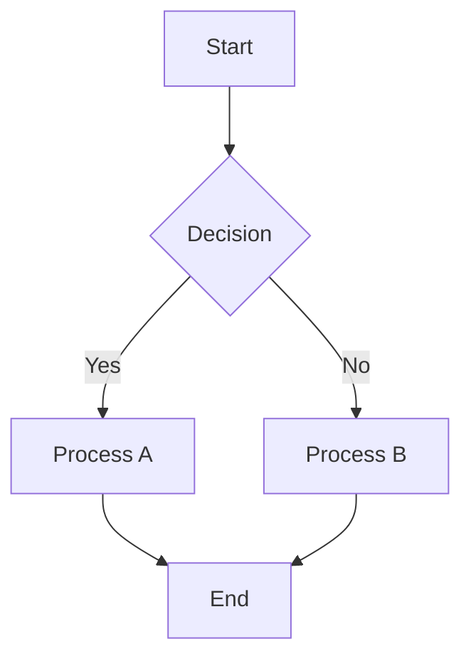

# Mermaid Visualizer

A modern, interactive web application that converts Mermaid flowchart code into beautiful, animated diagrams with a professional SaaS-grade interface.

## 🎨 Features

- **Real-time Mermaid Parsing**: Converts Mermaid syntax to interactive flowcharts
- **Modern UI**: Split-screen layout with glass morphism effects
- **Interactive Diagrams**: Pan, zoom, drag nodes with smooth animations
- **Export Functionality**: Download diagrams as SVG or PNG files
- **Theme System**: Light/dark mode with smooth transitions
- **Enhanced Editor**: Monaco editor with syntax highlighting and validation

## 🏗️ Architecture

```
Mermaid Code → Parser → Normalized Graph → Layout Engine → SVG Renderer
```

### Core Components

- **Parser Layer** (`src/parsers/`): Converts Mermaid syntax to normalized graph model
- **Layout Engine** (`src/layout/`): ELK-based automatic node positioning
- **Renderer Layer** (`src/renderers/`): SVG-based interactive diagram display
- **Components** (`src/components/`): UI components (editor, toolbar, minimap)
- **Hooks** (`src/hooks/`): Reusable React utilities (debounce)
- **Types** (`src/types/`): TypeScript interfaces for graph model

### Technology Stack

- **Frontend**: React 18 + TypeScript + Vite
- **Styling**: Tailwind CSS + Framer Motion + Lucide Icons
- **Editor**: Monaco Editor with custom themes
- **Layout**: ELK.js for automatic graph layout
- **Build Tool**: Vite with hot module replacement

## 🎯 Key Features

### Diagram Rendering
- Color-coded nodes based on type (Start/End, Process, Decision, Error)
- Gradient fills with smooth shadows and rounded corners
- Animated edges with arrowheads and labels
- Spring-based animations for smooth transitions
- Interactive pan, zoom, and drag functionality

### User Interface
- **Split-screen layout**: 40% editor, 60% diagram canvas
- **Floating toolbar**: Export, view controls, theme toggle
- **Minimap**: Bottom-right navigation overview
- **Glass morphism**: Backdrop blur effects throughout
- **Dark/Light themes**: Smooth theme switching with persistence

### Editor Experience
- **Syntax highlighting**: Color-coded Mermaid syntax
- **Real-time validation**: Visual indicators for valid/invalid syntax
- **Error display**: Inline error messages with helpful descriptions

## 🚀 Getting Started

### Prerequisites
- Node.js 18+ and npm
- Modern web browser with ES6+ support

### Installation

```bash
# Clone the repository
git clone https://github.com/your-username/mermaid-visualizer

# Install dependencies
cd mermaid-visualizer
npm install

# Start development server
npm run dev
```

### Usage

1. **Enter Mermaid Code**: Type or paste your flowchart syntax in the left editor
2. **Real-time Visualization**: Watch your diagram render instantly on the right
3. **Interactive Controls**: 
   - Pan: Click and drag the canvas
   - Zoom: Use mouse wheel or toolbar controls
   - Export: Download as SVG or PNG files
   - Theme: Toggle between light and dark modes

### Mermaid Syntax Examples



## 🎨 Design System

### Color Palette
- **Primary**: Blue (#3b82f6, #60a5fa)
- **Secondary**: Gray (#64748b, #94a3b8)
- **Accent**: Purple (#d946ef, #a21caf)
- **Success**: Green (#10b981)
- **Error**: Red (#ef4444, #dc2626)

### Node Types
- **Start/End**: Green→Blue gradient
- **Process**: Blue gradient
- **Decision**: Amber→Purple gradient
- **Error**: Red gradient with subtle glow

### Typography
- **UI Font**: Inter (300, 400, 500, 600, 700)
- **Code Font**: JetBrains Mono (400, 500, 600)

## 📱 Development

### Project Structure
```
mermaid-visualizer/
├── src/
│   ├── components/          # React components
│   ├── contexts/           # React contexts
│   ├── hooks/              # Custom React hooks
│   ├── layout/             # Graph layout algorithms
│   ├── parsers/            # Mermaid parsing logic
│   ├── renderers/          # SVG rendering components
│   ├── types/              # TypeScript type definitions
│   ├── styles/             # CSS and styling
│   ├── App.tsx              # Main application component
│   └── main.tsx            # Application entry point
├── public/                 # Static assets
├── package.json            # Dependencies and scripts
├── tailwind.config.js      # Tailwind CSS configuration
├── postcss.config.js       # PostCSS configuration
├── tsconfig.json          # TypeScript configuration
└── README.md              # This file
```

## 🤝 Contributing

We welcome contributions! Please ensure:

1. **Code Quality**: Follow existing patterns and maintain clean code
2. **Architecture**: Preserve the decoupled pipeline design
3. **Testing**: Add tests for new features
4. **Documentation**: Update README for API changes
5. **Performance**: Optimize for large diagrams and smooth interactions

---

**Built with ❤️ by Rishijeet Mishra**

## 📄 License

MIT License - feel free to use this project for personal or commercial purposes.
