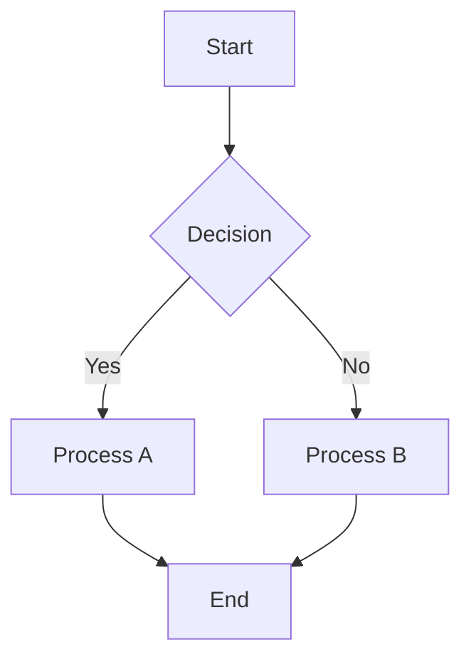

# Mermaid Visualizer

A modern, interactive web application that converts Mermaid flowchart code into beautiful, animated diagrams with a professional SaaS-grade interface.

## Features

- **Real-time Mermaid Parsing**: Converts Mermaid syntax to interactive flowcharts
- **Modern UI**: Split-screen layout with glass morphism effects
- **Interactive Diagrams**: Pan, zoom, drag nodes with smooth animations
- **Export Functionality**: Download diagrams as SVG or PNG files
- **Theme System**: Light/dark mode with smooth transitions
- **Enhanced Editor**: Monaco editor with syntax highlighting and validation

## Architecture

```
Mermaid Code → Parser → Normalized Graph → Layout Engine → SVG Renderer
```

### Core Components

- **Parser Layer** (`src/parsers/`): Converts Mermaid syntax to normalized graph model
- **Layout Engine** (`src/layout/`): ELK-based automatic node positioning
- **Renderer Layer** (`src/renderers/`): SVG-based interactive diagram display
- **Components** (`src/components/`): UI components (editor, toolbar, minimap)
- **Hooks** (`src/hooks/`): Reusable React utilities (debounce)
- **Types** (`src/types/`): TypeScript interfaces for graph model

### Technology Stack

- **Frontend**: React 18 + TypeScript + Vite
- **Styling**: Tailwind CSS + Framer Motion + Lucide Icons
- **Editor**: Monaco Editor with custom themes
- **Layout**: ELK.js for automatic graph layout
- **Build Tool**: Vite with hot module replacement

## Key Features

### Diagram Rendering
- Color-coded nodes based on type (Start/End, Process, Decision, Error)
- Gradient fills with smooth shadows and rounded corners
- Animated edges with arrowheads and labels
- Spring-based animations for smooth transitions
- Interactive pan, zoom, and drag functionality


## Getting Started

### Prerequisites
- Node.js 18+ and npm
- Modern web browser with ES6+ support

### Installation

```bash
# Clone the repository
git clone https://github.com/your-username/mermaid-visualizer

# Install dependencies
cd mermaid-visualizer
npm install

# Start development server
npm run dev
```

### Usage

1. **Enter Mermaid Code**: Type or paste your flowchart syntax in the left editor
2. **Real-time Visualization**: Watch your diagram render instantly on the right
3. **Interactive Controls**: 
   - Pan: Click and drag the canvas
   - Zoom: Use mouse wheel or toolbar controls
   - Export: Download as SVG or PNG files
   - Theme: Toggle between light and dark modes

### Mermaid Syntax Examples


```mermaid
graph TD
    A[Start] --> B{Decision}
    B -->|Yes| C[Process A]
    B -->|No| D[Process B]
    C --> E[End]
    D --> E
```

---

**Built with ❤️ by Rishijeet Mishra**

## 📄 License

MIT License - feel free to use this project for personal or commercial purposes.
